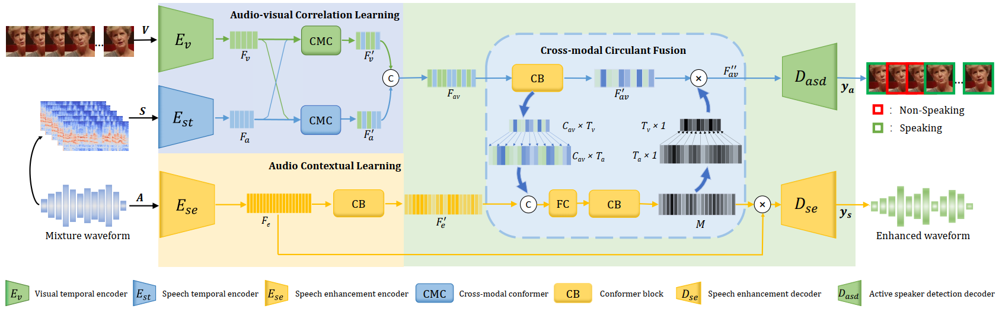

# ADENet
Pytorch implementation of the article [Look&Listen: Multi-Modal Correlation Learning for Active Speaker Detection and Speech Enhancement](https://arxiv.org/abs/2203.02216)

Project link:[ADENet](https://overcautious.github.io/ADENet/)



### Dependencies

Start from building the environment
```
conda env create -f env.yaml
```

***

## Training 
### Data preparation
#### 1.AVA dataset
The following script can be used to download and prepare the AVA dataset for training.

```
python trainADENet.py --dataPathAVA AVADataPath --download 
```

`AVADataPath` is the folder you want to save the AVA dataset and its preprocessing outputs, the details can be found in `/utils/tools.py`. Please read them carefully.

#### 2.MUSAN noise dataset
1. Download the MUSAN dataset [openslr](https://www.openslr.org/17/)
2. Using following script can clip noise audio, generate training set, validation set, test set
```
python generate_speech_noise 
```

### Training

Then you can train ADENet in AVA end-to-end by using:
```
python trainADENet.py --dataPathAVA AVADataPath ----dataPathMUSAN MUSANDataPath --savePath savePath
```

Using parameter `--isDown, --isDown` to control  cross-modal circulant fusion
***

### Citation

Please cite the following if our paper or code is helpful to your research.
```
@article{xiong2022look,
  title={Look$\backslash$\&Listen: Multi-Modal Correlation Learning for Active Speaker Detection and Speech Enhancement},
  author={Xiong, Junwen and Zhou, Yu and Zhang, Peng and Xie, Lei and Huang, Wei and Zha, Yufei},
  journal={arXiv preprint arXiv:2203.02216},
  year={2022}
}
```

This is my first open-source work, please let me know if I can future improve in this repositories or there is anything wrong in our work. Thanks for your support!

